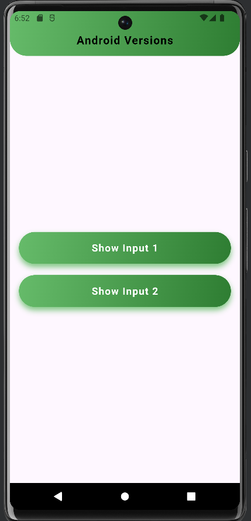
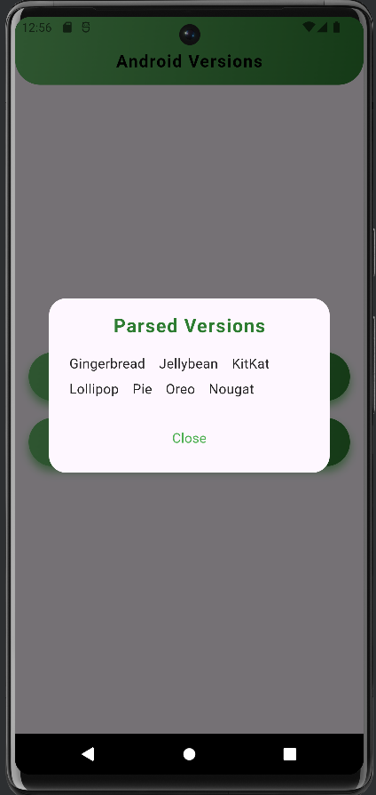
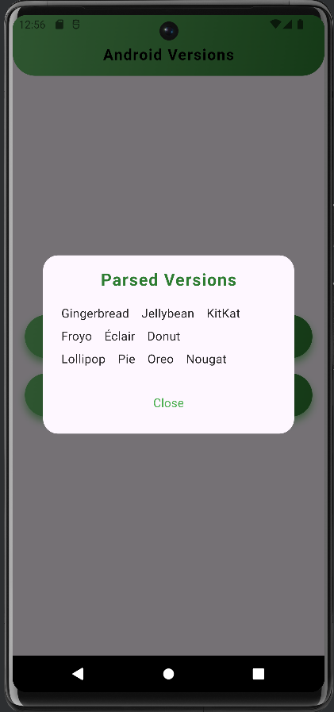

# Flutter Json Task App

A Flutter application to display list of android versions.

## Features

- Display a list of albums fetched from JSON
- Showing Android versions List
- Responsive and clean UI design


## Apk File Link

[Download the APK](https://drive.google.com/file/d/1YPqZFQf0J56vAe5Mi_liV46oY_s0reHz/view?usp=sharing)

## screenshots





## Video Link

[Watch the video](https://drive.google.com/file/d/1ODaeIDjd9NQWUq5zkuyHpJktWF2i1MuE/view?usp=sharing)

## Getting Started

### Prerequisites

- Flutter SDK: [Install Flutter](https://flutter.dev/docs/get-started/install)
- An IDE such as VSCode or Android Studio

### Installation

1. **Clone the repository:**

   ```sh
   https://github.com/zihadsikder/json_task
   cd json_task